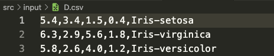
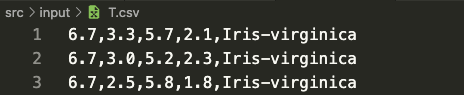
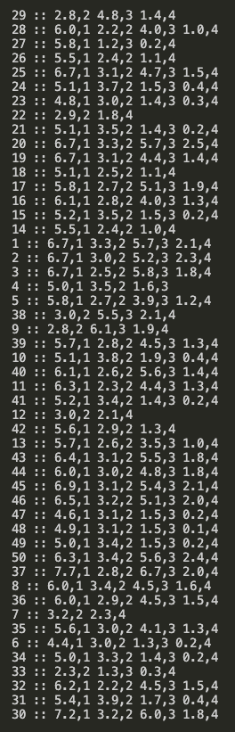
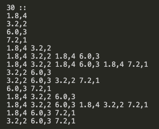
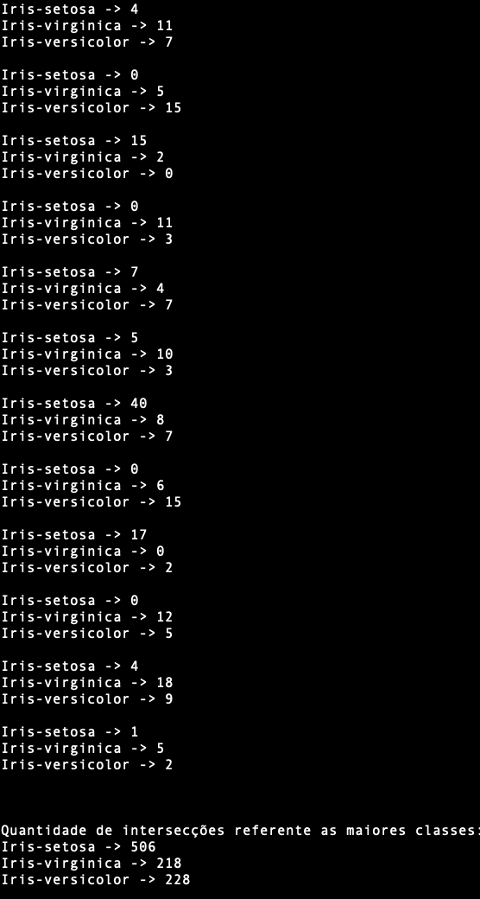
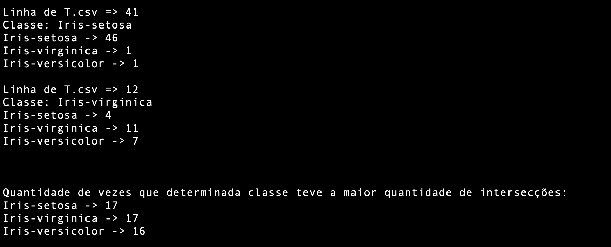
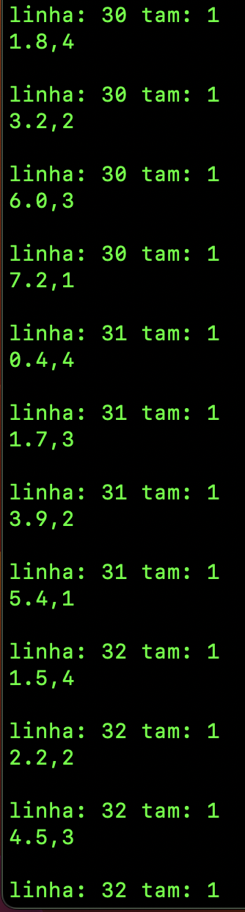
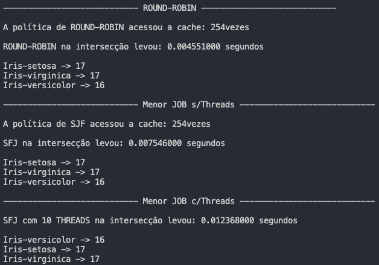

<h1 align = "center">Etapas do trabalho</h1>

## Etapa 1:

  A etapa 1 consiste em fazer a leitura dos arquivos <code>D.csv</code> e <code>T.csv</code>, e de forma independente, tokenizar cada arquivo conforme conforme suas regras.
Ambos os arquivos serão salvos em duas Hashs distintas cada <code>itensD</code>, <code>classesD</code> e <code>itensT</code>, <code>classesT</code>. 
Abaixo a uma demonstração de como foi realizado a tokenização e armazenamento nas Hashs.

  </img> Figura 1 
  
  Ao tokenizar todo o arquivo  <code>D.csv</code>, será inserido na hash as keys com seus repectivos valores. Com formato: <code>X,Y</code> -> <code>Z</code>. Sendo  <code>X = Número(float)</code>,  <code>Y = Coluna em que esse número aperece</code>, e <code>Z = Vetor com todas as linhas, cujo X aparece na coluna Y</code>.
  Nesse caso, será inserido em <code>itensD</code> e <code>classesD</code> levando em considerção soemnte a linha 1 como exemplo, temos:  
 
 <h4>ItensD</h4>
 <ul>
  <li>
    <code>5.4,1</code> -> <code>1 7 47 60 68</code>
  </li>
  <li>
    <code>3.4,2</code> -> <code>1 27 30 68 70 72 90 94</code>
  </li>
  <li>
    <code>1.5,3</code> -> <code>1 8 10 23 51 58 60 87 90</code>
  </li>
  <li>
     <code>0.4,4 </code> -> <code>1 7 58 70</code>
  </li>
</ul>

 <h4>ClassesD</h4>
  <code>Iris-setosa </code> -> <code>1 6 7 8 9 10 11 13 17 23 30 31 39 48 51 55 56 58 60 68 70 72 77 78 82 83 84 85 87 88 90 92 94 95 97</code>  
  
  <h5>OBS:</h5> No caso das Hashs de Classes para amabos os arquivos, a key será a chave e os valor será um vetor das linhas em que estas classes aparecem. Isso é feito, visto que em todos os arquivos as classes se localizam na 5ª coluna.  
  
  Já na tokenização do arquivo <code>T.csv</code>, temos uma inversão, ao se comparar com o modelo acima. Seguindo a imagem a baixo, ao tokenizar todo arquivo <code>T.csv</code> e tendo como exxemplo a linha 1. 
  
  </img>  Figura 2 
  
  O formato agora, será do tipo <code>U</code> -> <code>V,W</code> - A cada chave tem-se um vetor de pares <code>V,W</code>. Sendo <code>U = Linha que esta sendo tokenizada</code>,  <code>V = Numero(float)</code> e  <code>W = Coluna que este número se encontra</code>. Dessa forma, temos:
  
   <h4>ItensT</h4>
   
   * <code>1</code> -> <code>6.7,1 3.3,2 5.7,3 2.1,4</code>
   
   <h4>ClassesT</h4>
   
   * <code>Iris-virginica</code> -> <code>1 2 3 7 9 12 17 20 22 30 37 38 40 43 44 45 46 50</code>
  

## Etapa 2: 

  A etapa 2 consiste em fazer a checagem e salvar todos os valores de <code>itensT</code> que estão presentes como keys em <code>itensD</code>, cada valor encontrado é armazenado em uma nova Hash, chamada de <code>newItens</code>. A função <code>CheckKeyValues</code> é a responsável por fazer a checagem e o armazenamento. 
 Após, a checagem e o armazenamento, será feita a combinação de valores presentes na Hash. Combinação sem repetição, feita 1 a 1, depois 2 a 2 e assim sucessivamente até o fim do vetor de valores de cada key - armazenando em uma nova Hash de nome <code>newItensPerm</code> A Figura 3 mostra a impressão de <code>newItens</code> e a Figura 4 mostra a impressão de todas as combinações do vetor de valores da key = 30.
  
    Figura 3</img>
  
  É evidente que em <code>newItens</code> não são todas as chaves que possuem vetores com 4 elementos, isso significa q a checagem fez a seleção. 
  
    Figura 4</img>

## Etapa 3:

  Nesta etapa 3, é realizado a verificação de cada elemento do vetor de string em cada chave do `Map` - <code>newItensPerm</code>. Essa verificação é feita com cada key do Map `itensD`. Após esta verificação, inicia-se o processo de intersecção de cada vetor de inteiros referentes as linhas congruentes com a key, em cada item de `newItensPerm`. A lógica que faz está verificação de cada string dentro de `newItensPerm` está implementada na função `MakeIntersection()`- Nela é possível fazer a intersecção com mais de um elemento do vetor de inteiros.
Dentro de `MakeIntersection()`, após todo o fluxo de checagem e intersecção, tem-se um vetor *`vec_result`* e é por meio dele que é feito a intersecção com todas as classes. Estas intersecções são feitas pela função `IntersectionOnClass()`- Faz as intersecções e contabiliaza a quantidade de cada classe.
Depois, após terem sido feita todas as intersecões referente a respectiva key congruente de `newItensPerm`, é feito a contabilização da classe com o maior número de intersecções e assim, é armazenada em um novo Map chamado `IntersectionClass`.
> A cada string-valor pertencente ao `newItensPerm` é feito todo o processo de checagem, processamento e intersecção descrito a cima.

Na Figura 5 abaixo, temos um exemplo de várias intersecções e o total das classes com maiores intersecções.

 Figura 5 - Etapa 3

## Etapa 4:

A etapa 4 está dentro das implementações da etapa 3, mais precisamente dentro da função `MakeIntersection()`. Esta etapa consiste em simular uma memória *cache* por meio de uma **Hash** - unordered_map. Para cada nova ou futura intersecção que será feita, primeiro é verificado na "cache" se esta intersecão já foi realizada. Caso já tenha sido realizada, simplesmente é acessado o vetor de valores dessa intersecção salva como chave na hash de "cache" e assim este vetor de valores é passado para a função `IntersectionOnClass()`. Caso não esteja na "cache", é feita a intersecção conforme a etapa 3. Isso é feito para evitar processamento desnecessário Justamente o que um Sistema Operacional moderno deve fazer.

Ainda nesta etapa, foram feitas melhorias no quesito de representatividade da quantidade de intersecções de cada classe e no quesito de contabilizar quantas vezes determinada classe foi a com maior número de intersecções. A figura 6  abaixo, mostra um exemplo ao rodar as etapas 3 e 4 - que são dependentes.

 Figura 6 - Etapa 4.

Para verificar se realmente a classe com maior intersecões está conforme o arquivo `T.csv`, é imprimido a linha referente ao arquivo e a classe - entretando, essa congruência é feita sem acessar as **Hash's** referentes ao arquivo.

## Etapa 5
A etapa 5 consiste em alterar a antiga política de escalonamento para realizar as interseccões que foi implementada na "Etapa 3". A nova política escolhida foi a ***"Menor Job Primeiro"*** - do inglês, ***Shortest-Job-First*** (SFJ). Para implementar o SFJ, optei por não fazer grandes alterações no código, ou seja, fiz apenas modificações mínimas nos métodos referentes as combinações e as intersecções. Entretanto, fez-se necessário a criação de uma "Super estrutura" para que pegasse todas as combinaões armazenadas na Hash `newItensPerm` e as deixassem em formato ***SJF*** para então, fazer as intersecções com a ajuda da cache.

A "Super estrutura" criada é definada no arquivo de cabeçalho como **`SUPER_DATAset`**. É constituída por um vetor, tendo em cada posição uma Hash do tipo `unordered_map`, cuja a KEY corresponde a linha - ou KEY de `newItensPerm` - e o valor é uma segunda Hash do tipo `map`. Nesta Hash mais interna, a KEY é referente ao tamanho dos vetores q estarão presentes na matriz de `strings` - no caso, o valor da hash mais interna é uma matriz. Para exemplificar melhor como funciona esta "Super estrutura" de armazenamento, teremos a [Figura 4](#fig4) como base. O método ***NewPolitics_SJF*** acessa cada linha da Hash`newItensPerm`, ao acessar a linha 30 como na Figura 4, esta linha é salva como valor da primeira Hash da "Super estrutura" e então é acessada cada combinação - que são vetores de string. Na Hash mais interna, o primeiro armzenamento será feito de todas as combinações com tamanho igual a 1, e etão será salvo no padrão {1 -> Matriz de vetores de tamanho 1}. E assim é feito sucessivamente para cada linha e cada tamanho de combinação presentes e em cada KEY da Hash `newItensPerm`.

> O formato da "Super estrutura" é **`vector<unordered_map<int, map<int, MATRIX_string>> >`**

A impressão desta nova estrutura fica no formato ***SFJ***. Conforme a figura 7 abaixo.

  Figura 7 - Etapa 5

## Etapa 6

A etapa 6 consiste em implementar ***THREADS***  onde as intersecões são realizadas. Para análise de paralelimo, foi observado duas políticas de escalonamento: **Round-Robin** e **Shortest-Job-First**(SFJ). Mas apenas foi aplicado paralelismo na política de **Menor JOB Primeiro**.

A Figura 8 abaixo apresenta os tempos das duas políticas juntamente com a implementaão de Threads nas intesecões de SFJ.

> Conforme os resultados da Figura 8. Pode-se dizer que a forma como foi estruturada a política de SFJ tenha influenciado diretamente no seu tempo. Visto que,tanto sem, quanto aplicando Threads, tem-se que o tempo é maior para a política de **Menor JOB** em relação ao **Round-Robin**.

### Conclusão

A "Super estrutura" criada com o intuito de organizar as combinações para realizar as intersecções na política de Menor JOB, influenciou diretamente no tempo. A partir disso, pode-se concluir que a escolha de se utilizar matrizes de strings facilitou as etapas iniciais, uma vez que, não se fez necessário a tokenização para o processamento das etapas 3 e 4. Contudo, houve um alto custo de processamento para que estas matrizes fossem criadas e percorridas, para que então os processamentos secundários - como exemplo, fazer as intersecções - também fossem realizados na etapa 5 - para montar a "Super estrutura" e para percorrer a estrutura.

> A pessíma decisão de projeto implicou no aumento do tempo de uma política que na teória conforme a referência, teria um menor tempo.

