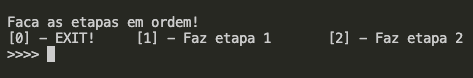

<h1 align="center"> Sistema Multitarefa </h1>

<p align="center">Gabriel Oliveira Alves - 2022<br> Disciplina de Sistemas Operacionais (SO)</p>

<h2> Introdução e Objetivo </h2>
    <p align="justify">
        Neste trabalho será construido um sistema de classificação cujas características nos permitirão observar conceitos importantes como: escalonamento e gestão de memória primária. Neste sistema, vamos considerar duas bases de dados D e T. A base D será utilizada para simular a inicialização, fornecendo assim o conceito de "bootstrapping", tal como no sistema operacional. Já a base T representará os processos a serem executados, cada um produzindo uma série de computações pesadas e necessárias, as quais vamos coordenar utilizando um sistema de escalonamento em dois níveis: "mecanismo" e "política". Além disso,será abordado o conceito de "memória", tratando de chavear os processos entre memória primária e processador, claro, tudo de forma simulada para que possamos extrair resultados mensuráveis para avaliação, análise e conclusão.<br>
       A documentação referente as etapas do trabalho esta presente em <a href = "https://github.com/Nerd100oculoS/Multitarefas-SO/blob/main/DOCUMENTATION.md"> DOCUMENTATION.md</a>.
      </p>

<h2>Requisitos, Compilação e Execução </h2>
  
  - Preferencialmente estar utilizando Linux ou MacOS como sistema operacional.
  - Ter o compilador GCC instalado.
  - Clonar o repositório.
  
  ```sh
  git clone https://github.com/Nerd100oculoS/Multitarefas-etapa1.git
  ```
   - Dentro da pasta deste repositório, executar os comandos a baixo conforme suas funções.
  
  | Comando                |  Função                                                                                           |                     
| -----------------------| ------------------------------------------------------------------------------------------------- |
|  `make clean`          | Apaga a última compilação realizada contida na pasta build                                        |
|  `make`                | Executa a compilação do programa utilizando o gcc, e o resultado vai para a pasta build           |
|  `make run`            | Executa o programa da pasta build após a realização da compilação                                 |

## Menu

Ao fazer a compilação será mostrado o seguinte menu de opções: 

</img>


